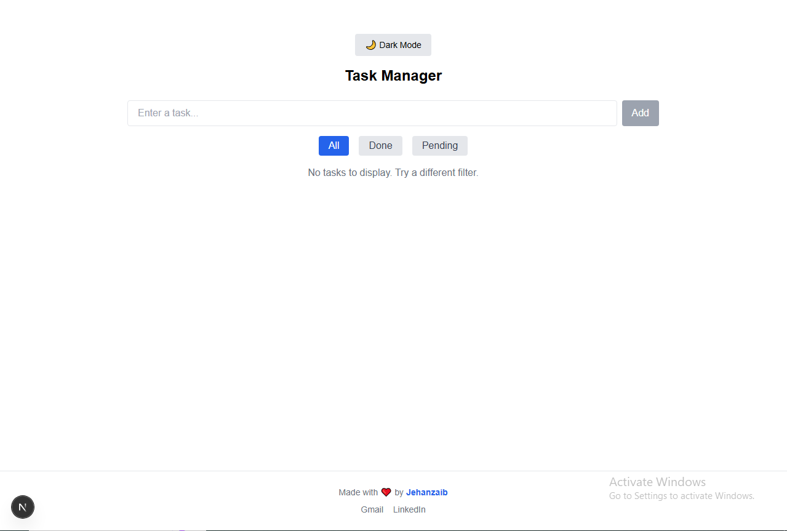
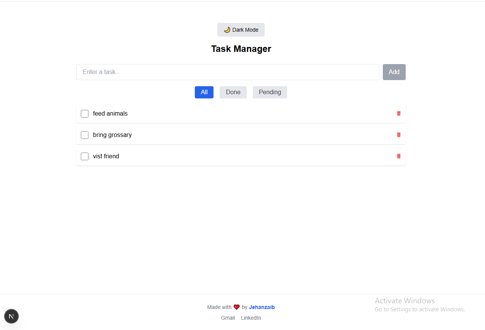
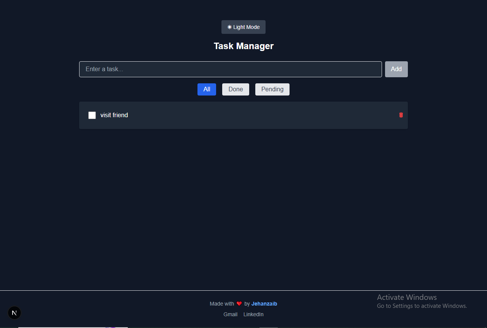

# Taskify 📝

Taskify is a sleek and responsive task management app built with **Next.js 15** and **Tailwind CSS 3**. It includes essential features like task creation, filtering, persistent storage, and dark mode support — designed as a professional front-end portfolio project.

---

## 🌐 Live Demo

> Add your deployment link here when ready.
> Example: [taskify.vercel.app](https://taskify.vercel.app)

---

## 🚀 Features

- ✅ Add tasks with validation (no empty submissions)
- ✅ Mark tasks as complete or pending
- ✅ Filter tasks: All | Done | Pending
- ✅ Persistent storage using `localStorage`
- ✅ Toggle Dark/Light mode
- ✅ Responsive UI with Tailwind CSS
- ✅ Clean, minimal design with a sticky footer
- ✅ Custom favicon and metadata

---

## 🛠️ Tech Stack

- **Next.js 15** (App Router)
- **React 19**
- **Tailwind CSS 3.4**
- **LocalStorage**
- **ESLint** (optional)

---

## 📷 Screenshots

### Home Page


### Items


### Dark Mode


---

## 🔧 Getting Started

```bash
# Clone the repo
git clone https://github.com/jehanzaib-dev/taskify.git

# Install dependencies
npm install

# Start the dev server
npm run dev
```

---


## 📬 Contact

Made with ❤️ by **Jehanzaib**  
📧 Gmail: [jehanzaib.dev@gmail.com](mailto:jehanzaib.dev@gmail.com)  
🔗 LinkedIn: [linkedin.com/in/jehanzaib-arshad-a722b6369](https://linkedin.com/in/jehanzaib-arshad-a722b6369)

---

## 📝 License

This project is for educational and portfolio purposes.
